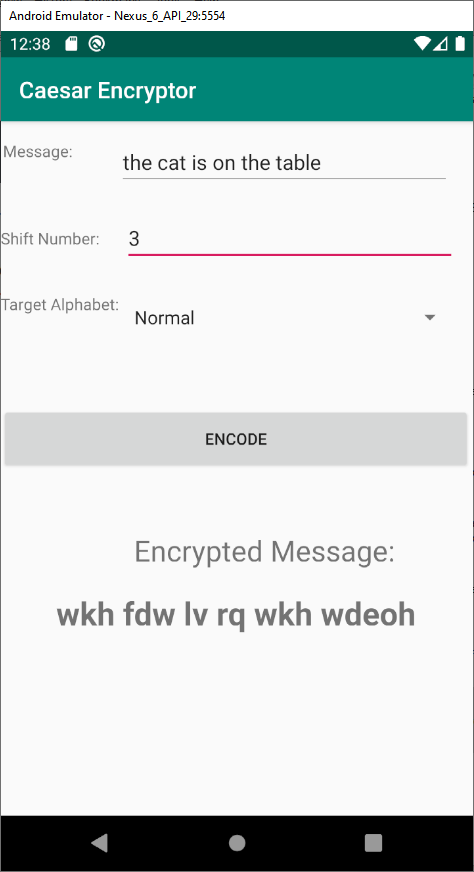

# About this project

This was an Android App academic individual project developed in AndroidStudio as part of a software development course in my master of computer science studies.

# Encryptor User's Manual

Encryptor is a very simple, fun and easy to use Android App. It consists of the following:

  - Encryption of input message using Caesar Cypher with Normal Alphabet
    * abcdefghijklmnopqrstuvwxyz
    * ABCDEFGHIJKLMNOPQRSTUVWXY
  - Encryption of the output Caesar Cypher message replacing all letters using Reverse Alphabet
    * zyxwvutsrqponmlkjihgfedcba
    * ZYXWVUTSRQPONMLKJIHGFEDCBA
  - Encryption of the output Caesar Cypher message replacing all letters using QWERTY Alphabet
    * QWERTYUIOPASDFGHJKLZXCVBNM
    * qwertyuiopasdfghjklzxcvbnm
	* 
	* 

# How to use it

  - Type in a word or sentence that you want to codify
  - Add a shift number to let the app encode based on the amount of letters it has to shift
  - Click the button ENCODE and and you will see your message encoded

# Example
    - Message: "XYZabcABCxyz", Shift: 3, Alphabet: Normal, Result: "ABCdefDEFabc"
    - Message: "Cat & Dog", Shift: 2, Alphabet: Reverse, Result: "Vxe & Ujr"
    - Message: "Up with the White And Gold!", Shift: 8 Alphabet: QWERTY, Result: "Eb tjwh whd Thjwd Ocs Gvzs!"

# Type of message
The Encryptor will only codify letters with letters. Numbers and other special characters stay as they are. Encryptor requires a valid input for both, the message and the shift:

* Message: a combination of letters and numbers, or only letters. A string made of numbers or other characters without adding at least one letter will give an error message
* Shift number: a number greater than 0 (zero) to tell the app how many letters to count to shift
* Alphabet selector: select any of the three options: Normal, Reverse, or QWERTY to encode your message

# Screenshots

  - Encryption using Normal Alphabet
    * 
  - Encryption using Reverse Alphabet
    * 
  - Encryption using QWERTY Alphabet
    * 